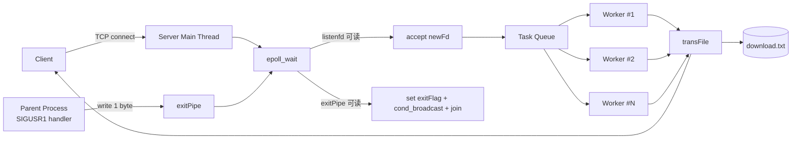

# ThreadPool 文件服务器（C 语言）

一个基于 `epoll + 线程池 + 任务队列` 的简化文件传输示例项目。
项目分为 `server` 和 `client` 两部分，适合用来学习 Linux 网络编程中“主线程负责 IO 事件分发、工作线程负责业务处理”的经典模型。

## 1. 项目能做什么

- 服务端监听 TCP 连接，接收客户端请求
- 主线程通过 `epoll` 监听新连接和退出事件
- 新连接以 `netFd` 形式进入任务队列
- 工作线程从任务队列取任务并发送文件
- 客户端接收文件并写入本地
- 支持通过信号触发优雅退出（广播唤醒线程并 `join`）

## 2. 代码目录（新手先看这里）

```text
ThreadPool/
├── server/
│   ├── server.c         # 主流程：fork + epoll + 投递任务 + 退出控制
│   ├── threadPool.h/.c  # 线程池结构与初始化
│   ├── worker.h/.c      # 线程创建与线程函数（消费任务）
│   ├── taskQueue.h/.c   # 链表队列（任务入队/出队）
│   ├── tcpInit.h/.c     # socket/bind/listen 初始化
│   ├── epoll.h/.c       # epoll_add / epoll_del 封装
│   ├── transFile.h/.c   # 文件传输协议实现（文件名+大小+内容）
│   ├── errorSet.h       # 参数/错误检查宏
│   └── Makefile         # 生成 server.out
└── client/
    ├── client.c         # 连接服务端并接收文件
    └── Makefile         # 生成 client.o（可执行文件）
```

## 3. 整体架构图（直观版）



## 4. 核心模块关系

| 模块 | 关键职责 | 关键接口 |
|---|---|---|
| `server.c` | 启动线程池、监听 socket、epoll 事件循环 | `threadPoolInit` `makeWorker` `epoll_wait` |
| `threadPool.*` | 组织线程池数据结构（线程数组、队列、锁、条件变量） | `threadPoolInit` |
| `worker.*` | 创建工作线程、循环取任务执行传输 | `makeWorker` `threadFunc` |
| `taskQueue.*` | 单向链表队列，存放 `netFd` | `enQueue` `deQueue` |
| `transFile.*` | 按协议发送文件名、文件大小、文件内容 | `transFile` |
| `client.c` | 按协议接收并落盘文件 | `recvn` `recvFile` |

## 5. 一次请求的执行流程

1. 客户端连接服务端。
2. 服务端 `epoll` 监听到 `sockfd` 可读，调用 `accept` 得到 `newFd`。
3. 主线程加锁后 `enQueue(newFd)`，随后 `pthread_cond_signal` 唤醒一个工作线程。
4. 工作线程被唤醒后取出队头 `netFd`，解锁并调用 `transFile(netFd)`。
5. `transFile` 发送：文件名 -> 文件大小 -> 文件内容（`sendfile`）。
6. 工作线程关闭该连接，继续等待下一个任务。

## 6. 传输协议说明

服务端和客户端使用相同的“火车车厢”结构：

```c
typedef struct train_s {
    int length;
    char data[1000];
} train_t;
```

发送顺序：

1. `length = 文件名长度`，`data = 文件名`
2. `length = sizeof(off_t)`，`data = 文件大小`
3. 发送原始文件字节流（`sendfile`）

客户端用 `recvn` 保证“按需读取指定长度”，避免 TCP 粘包/拆包导致的数据不完整。

## 7. 快速开始（可直接复制执行）

### 7.1 环境要求

- Linux（项目依赖 `epoll`、`pthread`、`sendfile`）
- `gcc`、`make`

### 7.2 编译

```bash
# 编译服务端
cd server
make

# 编译客户端
cd ../client
make
```

编译产物：

- 服务端：`server/server.out`
- 客户端：`client/client.o`（名字虽是 `.o`，但它是可执行文件）

### 7.3 准备测试文件

服务端当前固定发送 `download.txt`，需要放在 `server/` 目录下：

```bash
cd ../server
printf 'hello thread pool\n' > download.txt
```

### 7.4 启动服务端

```bash
cd /home/dingjr/workSpace/learnAbout/mycpp/linux/Thread/ThreadPool/server
./server.out 0.0.0.0 1234 3
```

参数说明：

- `0.0.0.0`：监听地址
- `1234`：监听端口
- `3`：工作线程数量

### 7.5 启动客户端下载

另开一个终端：

```bash
cd /home/dingjr/workSpace/learnAbout/mycpp/linux/Thread/ThreadPool/client
./client.o 127.0.0.1 1234
```

运行后会在客户端当前目录得到 `download.txt`。

## 8. 优雅退出（推荐方式）

服务端采用“父子进程 + 管道通知”机制：

- 父进程接收 `SIGUSR1`，向 `exitPipe` 写入 1 字节
- 子进程 `epoll` 监听到管道可读，设置 `exitFlag=1`
- 广播唤醒所有工作线程并 `pthread_join`

建议这样运行并退出：

```bash
cd server
./server.out 0.0.0.0 1234 3 &
SERVER_PARENT_PID=$!

# ...进行客户端测试...
kill -USR1 "$SERVER_PARENT_PID"
wait "$SERVER_PARENT_PID"
```

## 9. 常见问题

### Q1：客户端连上后下载失败，服务端报 `open` 错误？

因为服务端固定打开 `download.txt`（相对路径），请确认该文件存在于**服务端运行目录**。

### Q2：为什么客户端可执行文件叫 `client.o`？

`client/Makefile` 里把 `*.c` 直接编译成同名 `.o` 可执行文件，这是当前工程的命名约定，不影响运行。

### Q3：线程安全吗？

任务队列的入队/出队都在互斥锁保护下，并通过条件变量协调“队列为空时等待”。

## 10. 目前实现的边界与可改进点

- 仅演示“固定文件下载”，未实现按客户端请求选择文件
- 任务队列无容量上限与拒绝策略
- 缺少更细粒度的错误恢复与日志体系
- 未处理超大文件传输中的进度/限速/断点续传

如果你是新手，建议优先从以下顺序继续扩展：

1. 支持客户端传入文件名
2. 增加任务队列最大长度
3. 补充线程池销毁与资源回收函数
4. 为协议加入校验与错误码

---

如果你要继续迭代这个项目，可以先从 `server/server.c` 的主循环和 `server/worker.c` 的 `threadFunc` 开始读，基本就能串起全局。
